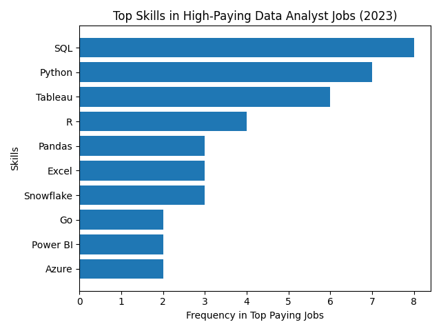

# Introduction

Dive into the data job market! Focusing on data analyst roles, this project explores top-paying jobs, in-demand skills, and where high demand meets high salary in data analytics.

SQL queries? Check them out here: [project_sql folder](/project_sql/).

# Background

Data hails from my [SQL Course](https://lukebarousse.com/sql). It's packed with insights on job titles, salaries, locations, and essential skills.

### The questions I wanted to answer through my SQL queries were:

1. What are the top-paying data analyst jobs?
2. What skills are required for these top-paying jobs?
3. What skills are most in demand for data analyst?
4. Which skills are associated with higher salaries?
5. What are the most optimal skills to learn?

# Tools I Used

For my deep dive into the data analyst job market, I harnessed the power of several key tools:

- **SQL :** The backbone of my analysis, allowing me to query the database and unearth critical insights.
- **PostgreSQL :** The chosen database management system, ideal for handling the job posting data.
- **Visual Studio Code :** My GO-TO for database management and executing SQL queries.
- **Git & GitHub :** Essential for version sontrol and sharing my SQL scripts and analysis, ensuring collaboration and tracking.

# The Analysis

Each query for this project aimed at investigating specific aspects of the data anlyst job market.
Here's how I approached each question:

### 1. Top Paying Data Analyst Jobs

To find highest-paying roles. I filtered data analyst positions by average yearly salary and location, focusing on remote jobs. This query highlights the high paying opportunities in the field.

```sql
SELECT
    job_id,
    job_title,
    job_location,
    job_schedule_type,
    salary_year_avg,
    job_posted_date,
    name AS company_name
FROM job_postings_fact
LEFT JOIN company_dim ON job_postings_fact.company_id = company_dim.company_id
WHERE
    job_title_short = 'Data Analyst'
    AND job_location = 'Anywhere'
    AND salary_year_avg IS NOT NULL
ORDER BY salary_year_avg DESC
LIMIT 10
```

Here's the breakdown of the top data analyst jobs in 2023:

- **Wide Salary Range :** Top 10 paying data analyst roles span from $184,000 to $650,000, indicating significant salary potential in the field.
- **Job Title Variety :** There's a high dversity in job titles, from Data Analyst to Director of Analytics, reflecting varied roles and specializations within data analytics.


_Bar graph visualizing the salary for the top 10 salaries for data analysts; ChatGPT generated this graph from my SQL query results_

### 2. Skills for Top Paying Jobs

To understand what skills are required for the top-paying jobs. I joined the job postings with the skills data, proving insights into what employers value for high-compensation roles.

```sql
WITH top_paying_jobs AS (
SELECT
    job_id,
    job_title,
    salary_year_avg,
    name AS company_name
FROM job_postings_fact
LEFT JOIN company_dim ON job_postings_fact.company_id = company_dim.company_id
WHERE
    job_title_short = 'Data Analyst'
    AND job_location = 'Anywhere'
    AND salary_year_avg IS NOT NULL
ORDER BY salary_year_avg DESC
LIMIT 10
)
SELECT
 top_paying_jobs.*,
 skills
 FROM
top_paying_jobs
INNER JOIN skills_job_dim ON top_paying_jobs.job_id = skills_job_dim.job_id
INNER JOIN skills_dim ON skills_job_dim.skill_id = skills_dim.skill_id

ORDER BY
    salary_year_avg DESC
```

Here’s what actually shows up most:

- SQL → 8 times
- Python → 7 times
- Tableau → 6 times
- R → 4 times
- Excel / Pandas / Snowflake → 3 times each
- Azure / Power BI / Go → 2 times



### 3. In-Demand Skills for Data Analysts

This query helped identify the skills most frequently requested in job postings, directing focus to areas with high demand.

```sql
SELECT
  skills,
  COUNT(skills_job_dim.job_id) AS demand_count
FROM job_postings_fact
INNER JOIN skills_job_dim ON job_postings_fact.job_id= skills_job_dim.job_id
INNER JOIN skills_dim ON skills_job_dim.skill_id = skills_dim.skill_id
WHERE
  job_title_short = 'Data Analyst'
GROUP BY skills
ORDER BY
  demand_count DESC
LIMIT 5
```

Here are the conslutions - High Demand Skills For Data Analyst 2023

- SQL is the most important skill → almost every job needs it
- Excel is still widely used → companies rely on it a lot
- Python is in high demand → helps with automation and advanced analysis
- Tableau and Power BI are needed to present data clearly
- Overall → SQL + Excel + Python + one visualization tool = core skills for data analysts

| Skill    | Demand Count |
| -------- | ------------ |
| SQL      | 92628        |
| Excel    | 67031        |
| Python   | 57326        |
| Tableau  | 46554        |
| Power BI | 39468        |

### 4. Skills Based on Salary

Exploring the average salaries associated with different skills revealed which skills are the highest paying.

```sql
SELECT
  skills,
  ROUND (AVG(salary_year_avg), 0) AS avg_salary
FROM job_postings_fact
INNER JOIN skills_job_dim ON job_postings_fact.job_id= skills_job_dim.job_id
INNER JOIN skills_dim ON skills_job_dim.skill_id = skills_dim.skill_id
WHERE
  job_title_short = 'Data Analyst'
  AND
  salary_year_avg IS NOT NULL
GROUP BY skills
ORDER BY
  avg_salary DESC
LIMIT 25
```

### Simple Conclusion

- High-paying skills are mostly advanced or niche tools, not basic analyst skills
- SQL and Excel are not in top salary list → they are expected, not premium
- Skills like TensorFlow, PyTorch, and Keras show that AI/ML knowledge increases salary
- Tools like Terraform, Kafka, and Airflow indicate data engineering skills pay more
- Overall → higher salary = specialized + technical skills, not just basic analysis

| Skill        | Avg Salary |
| ------------ | ---------- |
| svn          | 400000     |
| solidity     | 179000     |
| couchbase    | 160515     |
| datarobot    | 155486     |
| golang       | 155000     |
| mxnet        | 149000     |
| dplyr        | 147633     |
| vmware       | 147500     |
| terraform    | 146734     |
| twilio       | 138500     |
| gitlab       | 134126     |
| kafka        | 129999     |
| puppet       | 129820     |
| keras        | 127013     |
| pytorch      | 125226     |
| perl         | 124686     |
| ansible      | 124370     |
| hugging face | 123950     |
| tensorflow   | 120647     |
| cassandra    | 118407     |
| notion       | 118092     |
| atlassian    | 117966     |
| bitbucket    | 116712     |
| airflow      | 116387     |
| scala        | 115480     |

## 5. Most Optimal Skills to Learn

Combining insights from demand and salary data, this query aimed to pinpoint skills that are both in high demand and have salaries, offereing a strategic focus for skill development.

```sql
WITH skills_demand AS (
    SELECT
    skills_dim.skill_id,
    skills_dim.skills,
    COUNT(skills_job_dim.job_id) AS demand_count
    FROM job_postings_fact
    INNER JOIN skills_job_dim ON job_postings_fact.job_id= skills_job_dim.job_id
    INNER JOIN skills_dim ON skills_job_dim.skill_id = skills_dim.skill_id
    WHERE
    job_title_short = 'Data Analyst'
    AND
    salary_year_avg IS NOT NULL
    AND
    job_work_from_home = TRUE
    GROUP BY skills_dim.skill_id
), average_salary AS (
    SELECT
    skills_job_dim.skill_id,

    ROUND (AVG(salary_year_avg), 0) AS avg_salary
    FROM job_postings_fact
    INNER JOIN skills_job_dim ON job_postings_fact.job_id= skills_job_dim.job_id
    INNER JOIN skills_dim ON skills_job_dim.skill_id = skills_dim.skill_id
    WHERE
    job_title_short = 'Data Analyst'
    AND
    salary_year_avg IS NOT NULL
    GROUP BY skills_job_dim.skill_id
)

SELECT
    skills_demand.skill_id,
    skills_demand.skills,
    demand_count,
    avg_salary
FROM
    skills_demand
INNER JOIN average_salary ON skills_demand.skill_id = average_salary.skill_id
WHERE demand_count > 10
ORDER BY
    avg_salary DESC,
    demand_count DESC

LIMIT 25
```

### Key Findings

1. **High-Paying, In-Demand Skills**
   | Skill | Avg Salary ($) | Demand Count |
   |------------|---------------|--------------|
   | Confluence | 114,153 | 11 |
   | Spark | 113,002 | 13 |
   | Snowflake | 111,578 | 37 |
   | Hadoop | 110,888 | 22 |
   | NoSQL | 108,331 | 13 |

2. **Core Skills for Stability**
   - **Python** – 236 postings, $101,512
   - **SQL** – 398 postings, $96,435
   - **Tableau** – 230 postings, $97,978
   - **R** – 148 postings, $98,708
     > These skills provide strong job security and widespread applicability.

3. **Strategic Insight**
   - Combine **core skills** (Python, SQL, Tableau/R) for a solid foundation.
   - Add **specialized skills** (Snowflake, Spark, Hadoop, NoSQL) to maximize salary potential.
   - Supplement with **workflow tools** like Confluence, Jira, and Alteryx for operational efficiency.

### Recommendation

Focus on a **core + specialized skill strategy**:

- **Core Stack:** Python, SQL, Tableau/R
- **Specialized Stack:** Snowflake, Spark, Hadoop, NoSQL  
  This balances **job security, high demand, and financial upside** for remote Data Analyst roles.

# What I Learned

During this project, I deepened my understanding of **SQL for Data Analysts**, covering basic to advanced concepts, including:

- **Data Extraction & Filtering:** Using `SELECT`, `WHERE`, `JOIN`, and aggregate functions to pull meaningful insights from complex datasets.
- **Data Aggregation & Grouping:** Leveraging `GROUP BY`, `COUNT`, `SUM`, `AVG` to summarize large datasets efficiently.
- **Advanced Queries:** Utilizing nested queries, CTEs (Common Table Expressions), and window functions for deeper analytics.
- **Data-Driven Decision Making:** Applying SQL to identify trends, such as high-demand skills, salary distribution, and remote job opportunities.
- **Data Preparation for Visualization:** Creating structured outputs that can easily be used for charts and reports.

Through this, I gained practical experience in **analyzing job market data**, transforming raw job postings into actionable career insights.

# Conclusions

From the analysis of remote Data Analyst roles, the following insights emerged:

1. **High-Paying Skills:**  
   Skills like **Confluence, Spark, Snowflake, Hadoop, and NoSQL** offer the highest average salaries, making them valuable for salary maximization.

2. **Core Skills for Stability:**  
   Skills such as **Python, SQL, Tableau, and R** have very high demand, providing job security and widespread applicability.

3. **Optimal Career Strategy:**
   - **Core Stack (Job Security):** Python, SQL, Tableau/R
   - **Specialized Stack (Financial Upside):** Snowflake, Spark, Hadoop, NoSQL
   - Supplementing with **workflow and analytics tools** like Confluence, Jira, and Alteryx enhances efficiency and competitiveness.

4. **Actionable Insight:**  
   Focusing on both **high-demand core skills** and **specialized high-salary skills** positions aspiring Data Analysts for **remote opportunities with strong financial and career growth potential**.
